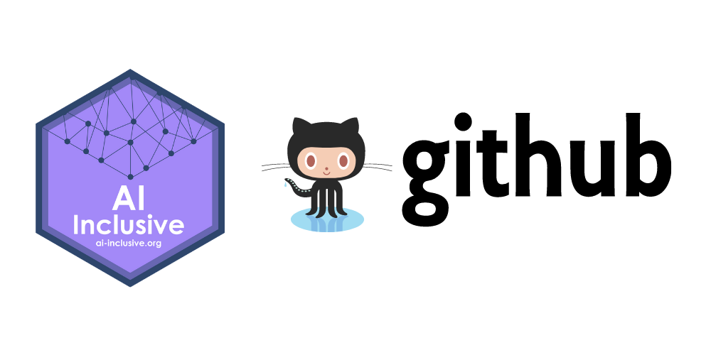

# Utilizando o GitHub para expor seus projetos de Data Science

[Link para a live no YouTube que ocorreu no dia 13/03/21](https://www.youtube.com/watch?v=Kkco06E_ZOY) 

Inscreva-se no canal para acompanhar outros cursos e lives promovidos.

O dados utilizados nos exemplos ministrados são do curso de [Data Analyst in Python do Dataquest](https://www.dataquest.io/path/data-analyst/).

[Link do Dataset utilizado](https://data.world/data-society/used-cars-data)

## 📝 Alguns pontos discutidos e ensinados:

- O que é o GitHub?
- O que é um repositório e como criar um?
- Onde desenvolver o seu projeto
- Explorar o Dataset 
- Dicas para o README
- Subir no GitHub
- Divulgar seus projetos nas redes (LinkedIn, Medium, Dev.to…)

## Algumas leituras complementares recomendadas:

- Como criar o seu GitHub Profile - Artigo da Letícia Silva: https://bit.ly/3vdQo8v

- Documentação do GitHub Profile: http://bit.ly/3rJ2HaZ

- Lista de Badges, em Markdown: http://bit.ly/3ldhnNe

- Emojis Cheatsheet: http://bit.ly/3qDahCJ

- Guia Markdown para te ajudar na criação do README: https://bit.ly/30wZ6AY

- Posts com dicas de onde encontrar datasets: https://bit.ly/3t3LA3V

## Cursos sobre Git e GitHub recomendados:

- Dataquest: https://bit.ly/2N8eQao

- Udacity: https://bit.ly/30u7WPV

- Codecademy: https://bit.ly/3bCJXEj

- Playlist Curso Git e GitHub - Gustavo Guanabara: https://bit.ly/3qzAd1Z

